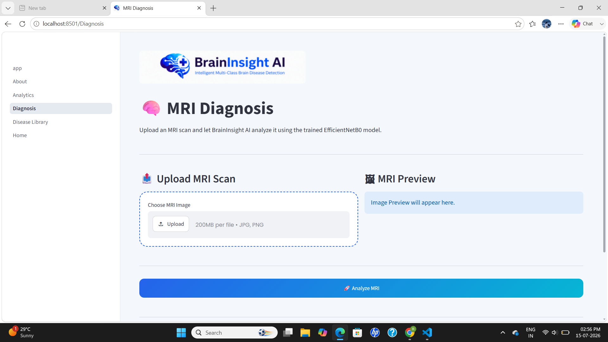
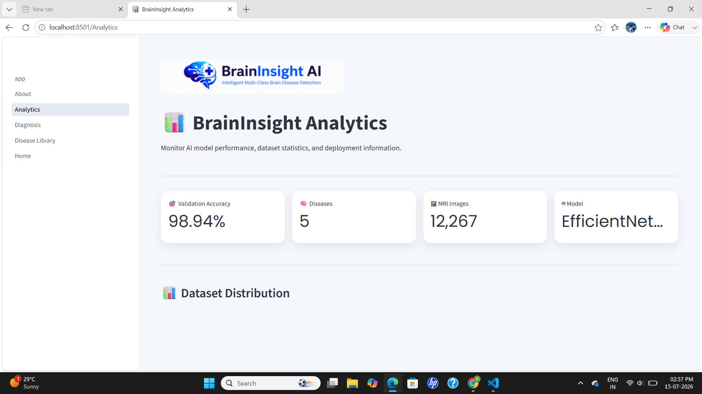
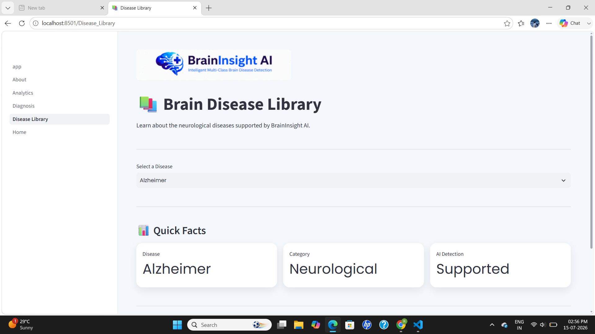
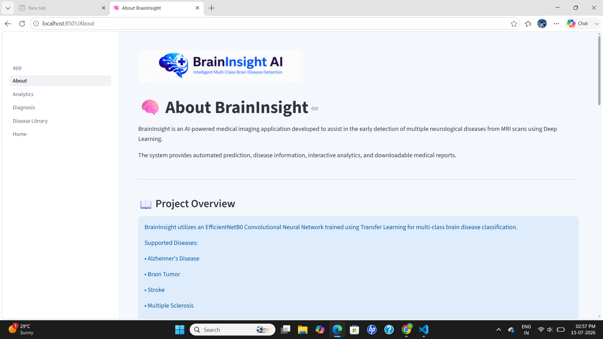

# 🧠 BrainInsight AI

> **AI-Powered Multi-Class Brain Disease Detection Using MRI Scans**

BrainInsight AI is a deep learning-based web application that assists in the detection of multiple neurological diseases from brain MRI scans. The application uses an EfficientNetB0-based Convolutional Neural Network trained with Transfer Learning to classify MRI images into five categories.

---

## 📌 Features

- 🧠 Multi-Class Brain Disease Detection
- 📤 MRI Image Upload & Preview
- 🤖 AI Diagnosis with Confidence Score
- 📊 Prediction Probability Visualization
- 📚 Brain Disease Information Library
- 📈 Interactive Analytics Dashboard
- 📄 Downloadable AI Medical Report (PDF)
- 💻 Modern Streamlit User Interface

---

## 🧠 Supported Diseases

- Alzheimer's Disease
- Brain Tumor
- Stroke
- Multiple Sclerosis
- Normal Brain

---

## 🛠️ Technology Stack

### AI & Machine Learning
- TensorFlow
- Keras
- EfficientNetB0
- NumPy
- OpenCV
- Scikit-learn

### Web Application
- Streamlit
- Plotly
- Pandas
- Pillow
- ReportLab

---

## 📂 Project Structure

```text
BrainInsight/
│
├── app.py
├── assets/
├── components/
├── model/
│   └── BrainInsight_Final.keras
├── pages/
│   ├── Home.py
│   ├── Diagnosis.py
│   ├── Analytics.py
│   ├── Disease_Library.py
│   └── About.py
├── utils/
├── requirements.txt
├── README.md
└── .gitignore
```

---

## 📊 Dataset

| Disease | Images |
|---------|-------:|
| Alzheimer's | 4500 |
| Brain Tumor | 4200 |
| Multiple Sclerosis | 1411 |
| Normal | 1400 |
| Stroke | 756 |

**Total Images:** 12,267

---

## 🤖 AI Model

- Model: EfficientNetB0
- Learning Technique: Transfer Learning
- Fine-Tuning: Yes
- Input Size: 224 × 224
- Output Classes: 5
- Framework: TensorFlow

---

## 🚀 Installation

Clone the repository:

```bash
git clone https://github.com/YOUR_USERNAME/BrainInsight.git

cd BrainInsight
```

Install dependencies:

```bash
pip install -r requirements.txt
```

Run the application:

```bash
streamlit run app.py
```

---

## 📸 Application Pages

- 🏠 Home
- 🧠 MRI Diagnosis
- 📊 Analytics Dashboard
- 📚 Disease Library
- ℹ️ About

---

## 🎯 Future Improvements

- Grad-CAM Explainable AI
- DICOM Image Support
- Doctor Dashboard
- Patient History Management
- Cloud Deployment
- Mobile Application
- Multi-language Support

---

## ⚠️ Disclaimer

BrainInsight AI is developed for educational and research purposes.

It is an AI-assisted screening tool and should **not** replace professional medical diagnosis or clinical decision-making.

---

## 👩‍💻 Developer

**Raksha**

Information Science & Engineering Student

Project: **BrainInsight AI – Automated Multi-Class Brain Disease Detection Using MRI Scans**

---

## ⭐ If you found this project useful, consider giving it a star on GitHub.
## 📸 Screenshots

### Home


### Diagnosis



### Analytics



### Disease Library



### About

